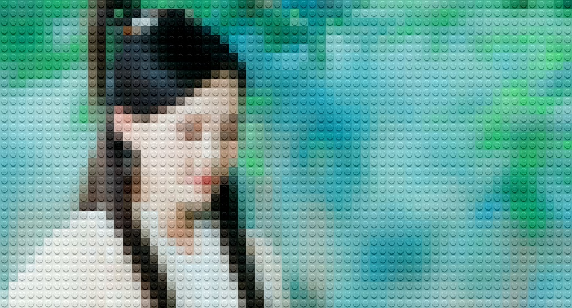

# Biến Ảnh thành Tranh LEGO bằng Python (LEGO Art Generator)

Dự án này là một tập lệnh Python nhỏ gọn giúp chuyển đổi bất kỳ hình ảnh nào thành một tác phẩm nghệ thuật theo phong cách tranh xếp hình LEGO. Đây là kết quả của quá trình học hỏi và thực hành theo video hướng dẫn trên YouTube.

<table align="center">
  <tr>
    <th align="center">Ảnh Gốc (Input)</th>
    <th align="center">Kết quả LEGO (Output)</th>
  </tr>
  <tr>
    <td align="center">
      
      <!-- Thay 'input.jpg' bằng đường dẫn chính xác tới ảnh gốc của bạn -->
    </td>
    <td align="center">
      
      <!-- Thay 'output.jpg' bằng đường dẫn chính xác tới ảnh kết quả của bạn -->
    </td>
  </tr>
</table>

---

## 🌟 Nguồn cảm hứng và Hướng dẫn

Dự án này được thực hiện hoàn toàn dựa trên video hướng dẫn của **Việt Nguyễn AI**. Xin gửi lời cảm ơn chân thành đến anh vì đã chia sẻ một hướng dẫn vô cùng trực quan và dễ hiểu.

- **Kênh YouTube:** Việt Nguyễn AI
- **Video gốc:** [Hướng dẫn Lego hóa bức ảnh bất kì chỉ với 20 dòng code](https://youtu.be/yQEk0Be5Xyw?si=k05Q_Q5_mfLfkRPC) <!-- Thay 'your_video_id' bằng ID của video gốc nếu bạn có link -->
- **Nội dung:** Video hướng dẫn chi tiết cách tạo ra một bức ảnh nghệ thuật Lego từ một bức ảnh bất kỳ bằng ngôn ngữ lập trình Python.

Quá trình tìm hiểu và viết lại code theo video đã giúp mình củng cố kiến thức về xử lý ảnh với thư viện OpenCV và thao tác trên mảng đa chiều với NumPy.

---

## 🧠 Cách hoạt động của mã nguồn

Tập lệnh hoạt động theo các bước logic sau:

1.  **Chuẩn bị "Gạch LEGO":**
    - Đọc một ảnh mẫu của viên gạch LEGO 1x1 (`1x1.png`).
    - Thay đổi kích thước viên gạch thành một kích thước chuẩn (ví dụ: 15x15 pixels) để làm "khuôn".
    - Áp dụng một phép biến đổi màu sắc đơn giản lên viên gạch để tạo hiệu ứng bóng và chiều sâu khi ghép vào ảnh.

2.  **Xử lý ảnh đầu vào:**
    - Đọc ảnh gốc mà người dùng muốn chuyển đổi (`input.jpg`).
    - Chuẩn hóa kích thước ảnh gốc sao cho chiều dài và chiều rộng của nó là bội số của kích thước viên gạch. Điều này đảm bảo ảnh có thể được chia đều thành các ô vuông.

3.  **Quá trình "LEGO hóa":**
    - Lặp qua từng "ô" (cell) của ảnh gốc, mỗi ô có kích thước bằng một viên gạch.
    - Với mỗi ô, tính toán màu sắc trung bình của tất cả các pixel trong ô đó.
    - Thay thế toàn bộ màu sắc của ô đó bằng màu trung bình vừa tính được.
    - Cộng thêm hiệu ứng bóng của viên gạch đã chuẩn bị ở bước 1.
    - Sử dụng `np.clip` để đảm bảo giá trị màu luôn nằm trong khoảng hợp lệ [0, 255].

4.  **Xuất kết quả:**
    - Ghi hình ảnh đã được xử lý ra một file mới có tên `output.jpg`.

---

## 🚀 Cách sử dụng

### Yêu cầu
- Python 3
- Thư viện OpenCV (`pip install opencv-python`)
- Thư viện NumPy (`pip install numpy`)

### Các bước thực hiện
1.  **Clone repository này:**
    ```bash
    git clone https://github.com/TranHuuDat2004/LEGO-python.git
    cd your-repo-name
    ```

2.  **Chuẩn bị file ảnh:**
    - Đặt một file ảnh tên là `1x1.png` (ảnh viên gạch LEGO mẫu) vào cùng thư mục.
    - Đặt file ảnh bạn muốn chuyển đổi với tên `input.jpg` vào cùng thư mục.

3.  **Chạy tập lệnh:**
    ```bash
    python your_script_name.py
    ```

4.  **Xem kết quả:**
    - Một file mới có tên `output.jpg` sẽ được tạo ra trong cùng thư mục. Đó chính là tác phẩm của bạn!

---

## 📜 Mã nguồn

```python
import cv2
import numpy as np

# Đọc và chuẩn bị "khuôn" gạch LEGO
lego_brick = cv2.imread("1x1.png")
size = 15 # Kích thước của mỗi viên gạch
lego_brick = cv2.resize(lego_brick, (size, size)).astype(np.int64)

# Tạo hiệu ứng bóng cho viên gạch
lego_brick[lego_brick < 33] = -100
lego_brick[(33 <= lego_brick) & (lego_brick <= 233)] -= 133
lego_brick[lego_brick > 233] = 100

# Đọc và chuẩn hóa kích thước ảnh đầu vào
image = cv2.imread("input.jpg")
image = cv2.resize(image, ( (image.shape // size )* size, (image.shape // size) * size))

height, width, channels = image.shape
print(f"Kích thước ảnh: {height}x{width}")

# Bắt đầu quá trình "LEGO hóa"
for i in range(width // size):
    for j in range(height // size):
        # Lấy ra một ô ảnh
        cell = image[j * size:( (j + 1) * size), i * size:( (i + 1) * size)]
        
        # Tính màu trung bình của ô
        avg_colors = np.mean(cell, axis=(0,1))
        
        # Áp dụng màu trung bình và hiệu ứng gạch LEGO
        image[j * size: (j + 1) * size, i * size: (i + 1) * size] = np.clip((avg_colors + lego_brick), 0, 255)

# Lưu ảnh kết quả
cv2.imwrite("output.jpg", image)

print("Hoàn thành! Kiểm tra file output.jpg")
```
